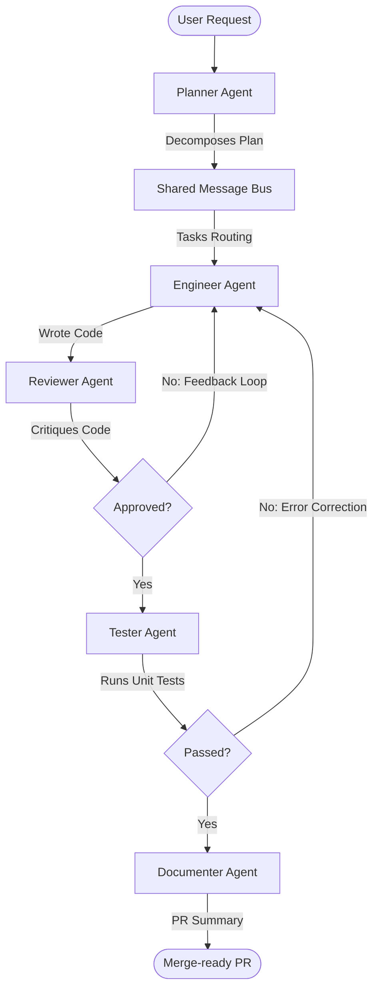

# ADVOCATE: Autonomous Multi-Agent SDLC System

ADVOCATE is a multi-agent software development lifecycle (SDLC) system where specialized AI agents collaborate autonomously to plan, code, critique, test, and release feature requests. 

The system features a real-time, glassmorphic developer dashboard to configure, launch, and monitor agent handoffs, inspect file trees, analyze live code diffs, read sandboxed test output, and view pull requests.

---

## System Architecture



### Core Agents

1. **Planner Agent**: Analyzes user requests, identifies dependency trees, determines file creation/modification routes, and outputs a structured JSON engineering plan.
2. **Engineer Agent**: Writes and refactors code inside the workspace sandbox, reacting to instructions and refactoring code iteratively when reviews or tests fail.
3. **Reviewer Agent**: Critiques implementations for architectural soundness, performance, style, and security, approving or request changes. Supports **Cross-Model Review** to reduce same-model cognitive bias (e.g., Anthropic Claude Haiku reviewing Claude Sonnet's output).
4. **Tester Agent**: Generates testing suites using Python's standard `unittest` framework, executes runs dynamically in a sub-process, and reports pass/fail logs.
5. **Documenter/Release Agent**: Gathers SDLC execution logs, code implementations, code reviews, and test reports to output a markdown Pull Request description and changelog.

### Shared Message Bus

Agents publish and consume messages using a central, event-driven `MessageBus`. This maintains state and coordinates routing. Events are pushed live to the web dashboard via WebSockets.

---

## File Structure

```text
e:/lablab project-1/
├── backend/
│   ├── agents/
│   │   ├── base.py          # Unified base agent class
│   │   ├── planner.py       # Planner Agent
│   │   ├── engineer.py      # Engineer Agent
│   │   ├── reviewer.py      # Reviewer Agent
│   │   ├── tester.py        # Tester Agent
│   │   └── documenter.py    # Documenter Agent
│   ├── bus.py               # Shared Event Message Bus
│   ├── llm.py               # Unified API Client (Claude, OpenAI, Gemini)
│   ├── main.py              # FastAPI server & route orchestration
│   ├── sandbox.py           # Sandboxed file/process manager
│   └── simulated_data.py    # Simulated logs & events for Demo Mode
├── frontend/
│   ├── index.html           # Glassmorphic developer dashboard
│   ├── styles.css           # Custom styles, animations & diff themes
│   └── app.js               # Websocket bindings & UI interactive logic
├── workspace/               # Sandboxed directory where agents write files & tests
├── run.bat                  # Windows startup batch command
└── README.md                # System documentation
```

---

## Getting Started

### Prerequisites

You need the `uv` package manager installed. If not available on your path, install it using the system instructions. (Our IDE automatically sets up and maps `uv` locally).

### Running Locally

1. Start the server using the batch script:
   ```bash
   run.bat
   ```
   *Alternatively, run:*
   ```bash
   uv run backend/main.py
   ```

2. Open your web browser and navigate to:
   [http://localhost:8000](http://localhost:8000)

3. **Demo Mode (Out of the Box)**:
   Choose one of the pre-loaded developer scenarios (e.g., *Thread-Safe LRU Cache*, *Token Bucket Limiter*, or *JWT Authorization*) under **OR RUN BUILT-IN DEMO** to watch the multi-agent system collaborate in real time with high-fidelity logs, workspace updates, and test executions.

4. **Real Mode (Autonomous Execution)**:
   - Click the **Keys** button in the header and input your API credentials (e.g., Anthropic API Key).
   - Enter your prompt in the command center text field (e.g., *"Create an email validator with unit tests"*).
   - Select your LLM backbone (e.g., Anthropic or OpenAI) and click **Run Orchestration**.
   - Watch the agents dynamically write files and run real test suites inside `./workspace/`!

---

## Deployment Guide

You can package and deploy ADVOCATE to various hosting platforms or run it in a containerized environment.

### 1. Deploying to Render
Render can auto-detect configuration from our `render.yaml` blueprint.
1. Connect your GitHub repository to [Render](https://render.com).
2. Create a new **Blueprint** or **Web Service** from the dashboard.
3. If creating a **Web Service**:
   - Set the runtime environment to **Python**.
   - Build command: `pip install -r requirements.txt`.
   - Start command: `python backend/main.py`.
   - Add an environment variable `PORT` set to `8000` (or leave it dynamic).
4. Render will deploy the application and serve the glassmorphic dashboard on your public `.onrender.com` URL.

### 2. Deploying with Docker
A pre-configured `Dockerfile` and `docker-compose.yml` are provided in the root directory.
- **Run with Docker Compose**:
  ```bash
  docker-compose up --build
  ```
  This builds the image and exposes the dashboard on port `8000`. The `/app/workspace` directory is mounted to `./workspace` on the host to persist files generated by agents.

- **Build and Run Manually**:
  ```bash
  docker build -t advocate-sdlc-system .
  docker run -p 8000:8000 advocate-sdlc-system
  ```

### 3. Deploying to Heroku
1. Install [Heroku CLI](https://devcenter.heroku.com/articles/heroku-cli).
2. Create a Heroku application:
   ```bash
   heroku create advocate-sdlc-system
   ```
3. Deploy changes:
   ```bash
   git push heroku main
   ```
   *Note: Heroku automatically reads `requirements.txt` and binds to the dynamic `$PORT` environment variable, which the backend will resolve on startup.*
